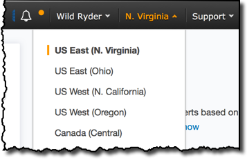

# Lab 1a: Creating a Notebook Instance

## Login and Select N. Virginia Region

To get started, you'll need to log into the AWS console, see [Getting Started](../login.md) for help.

Once there, be sure that you are operating in the **us-east-1** region by selecting **N. Virginia** from the chooser in the upper right hand corner of your AWS Console.



---

We'll create a SageMaker notebook instance, which we will use to run the other workshop modules as docker is not supported in SageMaker Studio.


#### High-Level Instructions

Use the console or AWS CLI to create an Amazon S3 bucket. Keep in mind that your bucket's name must be globally unique across all regions and customers. We recommend using a name like `smworkshop-firstname-lastname`. If you get an error that your bucket name already exists, try adding additional numbers or characters until you find an unused name.

??? optional-class "Step-by-step instructions to create an S3 bucket (expand for details)"
	1. In the AWS Management Console, choose **Services** then select **S3** under Storage.
	2. Choose **+Create Bucket**
	3. Provide a globally unique name for your bucket such as `smworkshop-firstname-lastname`
	4. Select the Region you've chosen to use for this workshop from the dropdown
	5. Choose **Create** in the lower left of the dialog without selecting a bucket to copy settings from.


<!--
### 2. Use CloudFormation to Set Up a SageMaker Role

1. Click on AWS CloudFormation from the list of all services. This will bring you to the AWS CloudFormation console homepage.

2. Click on **Create new stack**

3. Choose **Specify an Amazon S3 template URL**, paste the following URL and hit **Next**: ```https://ml-materials.s3.amazonaws.com/WorkshopResources/SagemakerRoleCF.template```

4. Name your stack ```AmazonSageMaker-ExecutionRole``` and choose **Next**

5. Leave options as they are and choose **Next**

6. Check the box next to **I acknowledge that AWS CloudFormation might create IAM resources.** and choose **Create**

7. Refresh the page after a few seconds to make sure that the **Status** reads ```CREATE_COMPLETE```

8. Click on the **Outputs** tab and make note of the ARN value that looks like ```arn:aws:iam::XXXX::role/AmazonSageMaker-ExecutionRole-SageMakerLab-XXXX```. You will need this value in the next step.
-->

### 2. Launching the Notebook Instance

1\. In the upper-right corner of the AWS Management Console, confirm you are in the desired AWS region (N. Virginia).

2\. Click on Amazon SageMaker from the list of all services.  This will bring you to the Amazon SageMaker console homepage.


3\. To create a new notebook instance, go to **Notebook instances**, and click the **Create notebook instance** button at the top of the browser window.


4\. Type [First Name]-[Last Name]-workshop into the **Notebook instance name** text box, and select ml.m4.xlarge for the **Notebook instance type**.

5\. For IAM role, choose **Create a new role**. On the **Create an IAM role** screen, select **Any S3 bucket** and click **Create role**.


6\. Click **Create notebook instance**.  This may take several minutes to complete.


### 3. Accessing the Notebook Instance

1\. Wait for the server status to change to **InService**. This may take a few minutes.


2\. Click **Open Jupyterlab**. You will now see the Jupyterlab homepage for your notebook instance. Note that the notebook list will most likely be empty.

??? optional-class "Approximate times (expand for details)"
	- Launching the notebook takes about 4 minutes
	- Total lab time is about 10 minutes


!!! Done
